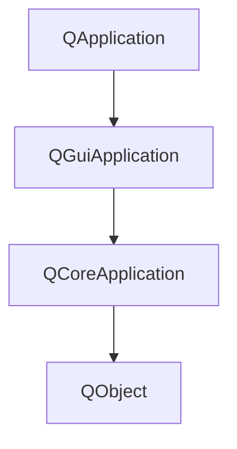

### `QCoreApplication`

```c++
#include <QCoreApplication>
int main(argc, char *argv[]) {
    QCoreApplication a(argc, argv);
    return a.exec();
}
```

退出条件，获得`exit()`

 ### `QGui`

```c++
#include <QtGui>
#include <QWindow>

int main(int argc, char *argv[])
{
    QGuiApplication a(argc, argv);
    QWindow w;
    w.show();
    return a.exec();
}
```

此处`QWindow`类里并没有使用任何GUI头文件，基类是`QObject`

###`QGuiApplication`