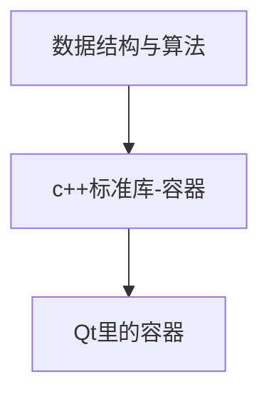

学习顺序：

就此打住，开始学习`LeetCode`里面的数组

是不对的，应该跳过这里，边学数据结构边学QT

或者直接学习

### 顺序（sequence）容器

QList QVector

#### QList

用大括号赋值，用逗号分割

**QLocale**和**QCollator**用来排序

### 关联（ordered）容器

QSet QMap

#### QSet

只有键，没有值，不能排序

#### QMap

