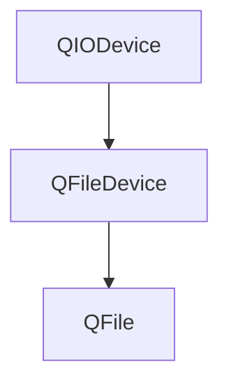

#### 查找文件是否存在

```c++
#include <QCoreApplication>
#include <QFile>
int main(int argc, char *argv[])
{
    if (argc != 2)
    {
        qWarning("请给出文件名称！！");
        return 1;

    }
    QString filename = argv[1];
    qDebug()<<filename;

    QFile f(filename);
    if (!f.exists())
        qWarning("无文件");
    qDebug()<<f.fileName();
}

```

#### 读取文件内容

```c++
#include <QCoreApplication>
#include <QFile>
int main(int argc, char *argv[])
{
    QFile f("words.txt");
    if(!f.open(QIODevice::ReadOnly)) {
        qWarning("打不开");
        return 1;
    }
    QTextStream in(&f);
    while(!in.atEnd()){
        QString line = in.readLine();
        qDebug() << line;
    }
}

```

#### 写文件内容

```c++
#include <QCoreApplication>
#include <QFile>
int main(int argc, char *argv[])
{
    QTextStream out{stdout};
    out.setEncoding(QStringConverter::System);
    QString filename = "names.txt";
    QFile f(filename);
    if (f.open(QIODevice::WriteOnly)) {
        QTextStream out(&f);
        out<<"孟凯"<<Qt::endl;
        out<<"今天"<<Qt::endl;
        out<<"没有"<<Qt::endl;
        out<<"干活"<<Qt::endl;

    } else
        qWarning("不存在要写入的文件");
    return 1;
}
```

#### 拷贝文件

```c++
QFile::copy(src,name);
```

