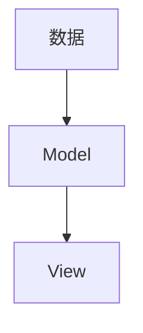
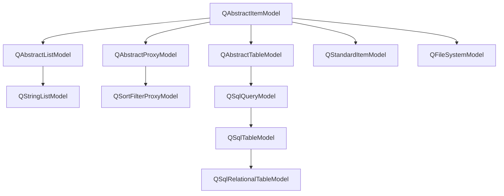

`数据：`数据表、SQL查询结果、StringList或者是磁盘文件结构等

`Modle:`与数据通信，并为视图组件提供数据接口

`View:`屏幕上的界面组件，视图从数据模型获得每个数据项的模型索引（model index）,通过模型索引获取

### 数据模型

 

| Model类                    | 用途                                                       |
| -------------------------- | ---------------------------------------------------------- |
| `QStringListModel`         | 用于处理字符串列表数据的数据模型类                         |
| `QStandardItemModel`       | 标准的基于项数据的数据模型类，每个项数据可以是任何数据类型 |
| `QFileSystemModel`         | 计算机上文件系统的数据模型类                               |
| `QSortFilterProxyModel`    | 与其他数据模型结合，提供排序和过滤功能的数据模型类         |
| `QSqlQueryModel`           | 用于数据库SQL查询结果的数据模型类                          |
| `QSqlTableModel`           | 用于数据库的一个数据表的数据模型类                         |
| `QSqlRelationalTableModel` | 用于关系型数据表的数据模型类                               |

### 视图组件

显示数据时，只需要调用视图类的`setModel()`函数

  

类可以修改，方法可以重写 