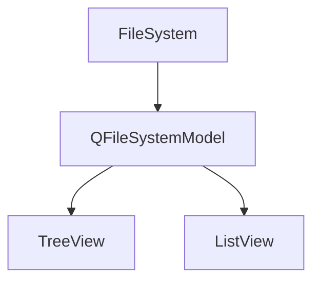

### 源代码

```c++
#include "mainwindow.h"
#include "./ui_mainwindow.h"
#include <QtWidgets>
MainWindow::MainWindow(QWidget *parent)
    : QMainWindow(parent)
    , ui(new Ui::MainWindow)
{
    ui->setupUi(this);
    model = new QFileSystemModel;
    model->setRootPath(QDir::currentPath());
    ui->treeView->setModel(model);
    ui->listView->setModel(model);

    connect(ui->treeView, &QTreeView::clicked,
            ui->listView, &QListView::setRootIndex);
}

MainWindow::~MainWindow()
{
    delete ui;
}


void MainWindow::on_treeView_clicked(const QModelIndex &index)
{
    QString status = model->filePath(index);
//    statusBar()->showMessage(status);
    if(!model->isDir(index)){
        status+=" size:";
        int size  = model->size(index)/1024;

        if(size<1024)
            status += QString("%1 KB").arg(size);
        else
            status += QString::asprintf("%.2f MB", size/1024.0);
    }
    statusBar()->showMessage(status);
}

```

基本上理解了在头文件随便声明类


此部分虽然实现了功能，但是对`model`的理解仍然不够深入

尤其是`view`部分的`index`和`model`的关系

