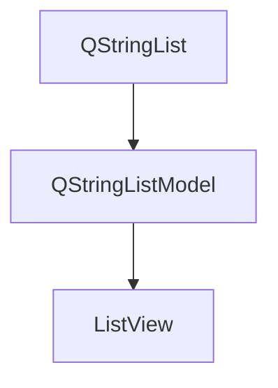

### 源代码

```c++
#include "mainwindow.h"
#include "./ui_mainwindow.h"
#include <QStringListModel>

MainWindow::MainWindow(QWidget *parent)
    : QMainWindow(parent)
    , ui(new Ui::MainWindow)
{
    ui->setupUi(this);
    setWindowTitle("QStringListModel");
    model = new QStringListModel;
    QStringList cities = {"北京","上海","广州","深圳"};
    model->setStringList(cities);
    ui->listView->setModel(model);
    ui->listView->setEditTriggers(QAbstractItemView::NoEditTriggers);


}

MainWindow::~MainWindow()
{
    delete ui;
}


void MainWindow::on_btnRese_clicked()
{
    model->removeRows(0, model->rowCount());
}


void MainWindow::on_btnAdd_clicked()
{
    model->insertRow(model->rowCount());
    QModelIndex index = model->index(model->rowCount()-1);
    model->setData(index, "new item", Qt::DisplayRole);
    ui->listView->edit(index);
}

void MainWindow::on_btnClear_clicked()
{
    QModelIndex index =ui->listView->currentIndex();
    model->removeRow(index.row());
}


void MainWindow::on_btnReset_clicked()
{

    QModelIndex index =ui->listView->currentIndex();
    ui->listView->edit(index);
}

```

**总结**

如果是修改内容，要修改`model`里面的，如果是要确定所选择的索引，需要用`ui`下的`ListView`