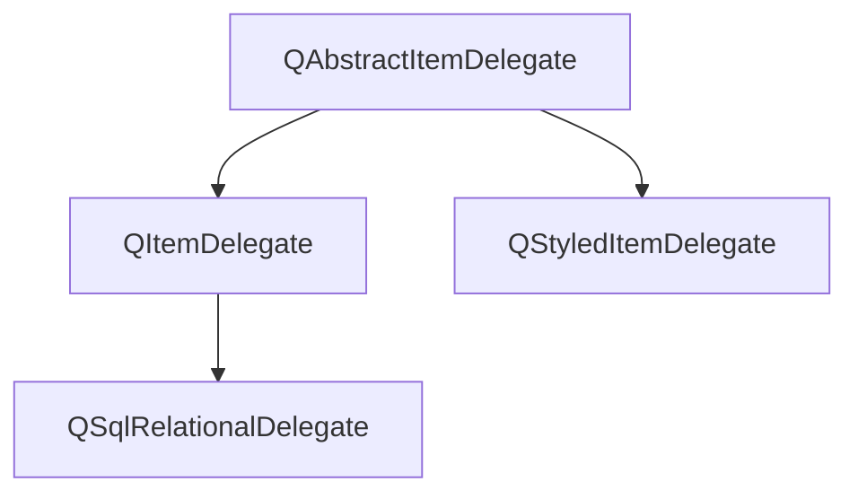

在标准的视图组件中，代理功能显示一个数据，当数据被编辑时，提供一个编辑器，一般是`QLineEdit`

`QAbstractItemDelegate`是所有代理类的抽象基类。

`QStyledItemDelegate`是视图组件使用的缺省的代理类，`QItemDelegate`也是类似功能的累，区别在于，`QStyledItemDelegate`可以使用当前的样式表设置来绘制组件，因此建议使用`QStyleedItemDeletgate`



成员函数

```
craateEidtor() //创建widegt 组件
setEditorData() // 从数据模型获取数据
setModelData() //将widget上的数据更新到数据模型
updateEditorGeometry() //用于给widget组件设置一个合适的大小
```

此部分应该暂时用不到，先不学了